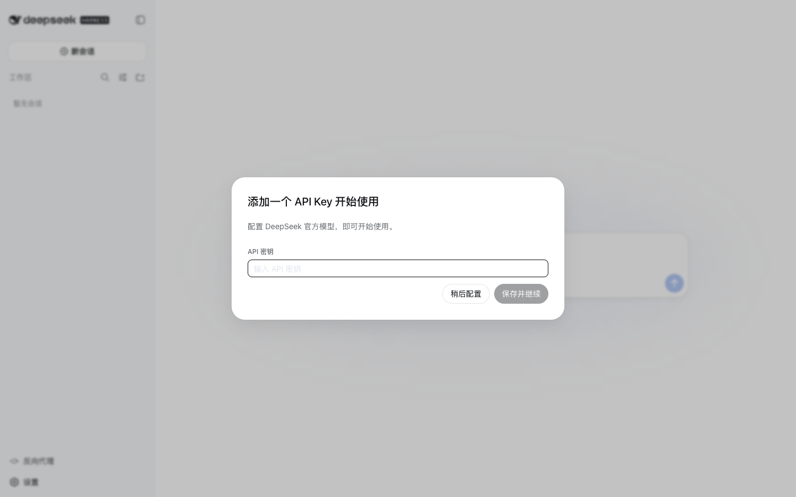
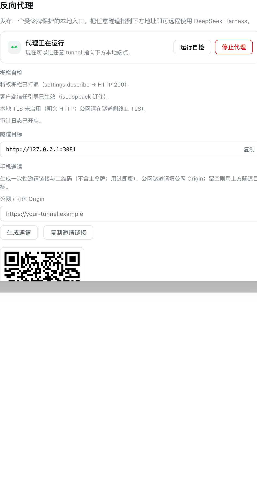
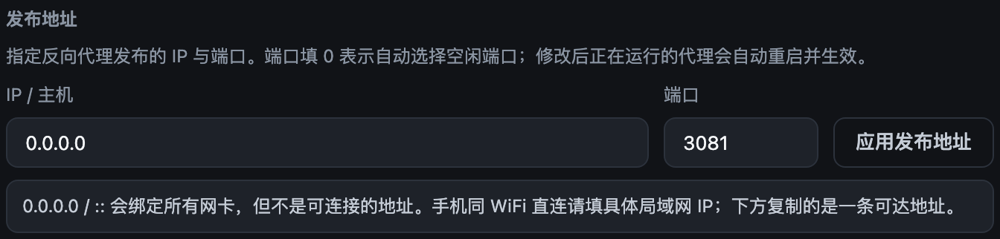
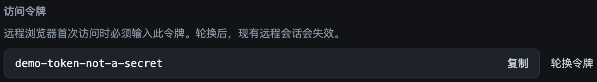
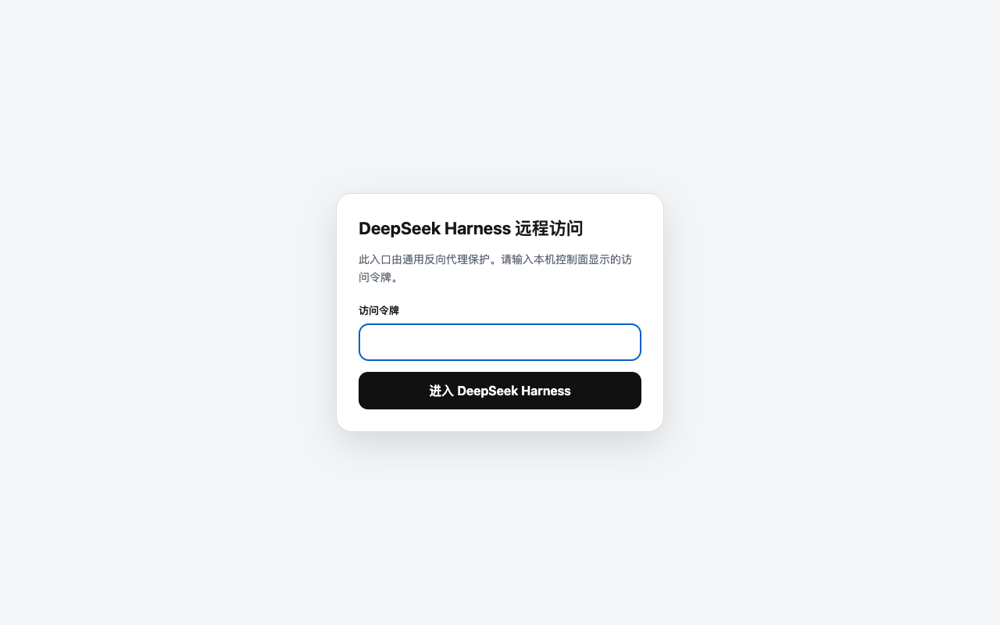
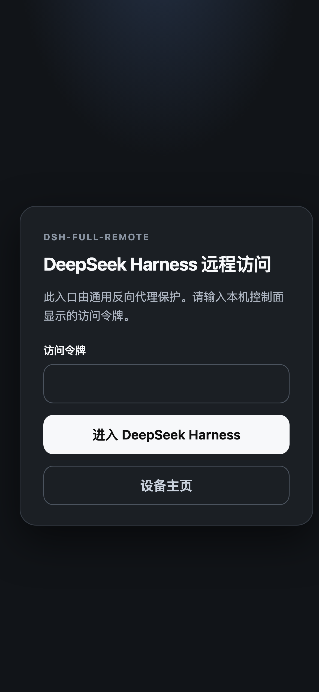

# dsh-full-remote

[](https://github.com/JUANWANG-BUAA/dsh-remote/actions)
[](./LICENSE)
[](https://github.com/JUANWANG-BUAA/dsh-remote/stargazers)
[](https://github.com/JUANWANG-BUAA/dsh-remote/commits/main)
[](./package.json)
[](https://github.com/deepseek-ai/deepseek-harness)
[](https://github.com/JUANWANG-BUAA/dsh-remote/pulls)

**English** | [中文](./README.zh.md)

Remote access to DeepSeek Harness Web with **full server-side API access**.

When you reach Harness through a generic tunnel, methods such as
`settings.*`, `credentials.*`, and `host.listDirectory` return 403. That is
not a bug in the tunnel: Harness's browser trust fence only reads HTTP
headers, and a public Host/Origin fails it. This plugin rewrites Host and
Origin to `127.0.0.1:<backendPort>` on the way through, so the fence lets
those privileged methods through — the same methods every other remote
plugin leaves 403.

The fence no longer protects the remote side, so this plugin puts a
stronger door in front: a 192-bit access token, per-device credentials
(hash at rest), failed-login rate limits, and optional first-visit
approval.

**The claim is server-side API completeness, not a complete UI.** Harness's
official settings panel has a second, independent client check
(`connection.isLoopback`) inferred from the page URL. Under a tunnel
hostname the panel still runs in a memory scope and edits do not persist.
The APIs themselves return 200. See [Known Limitations](#known-limitations-and-deferred-work).

The plugin does not launch or manage tunnel software. Point frp, ngrok,
cloudflared, Tailscale, SSH, or anything else at the local target shown in
the sidebar.

## Screenshots

Each feature is shown against a clean harness profile (no personal data).

| Feature | Screenshot |
|---|---|
| Sidebar entry — own row above the other footer actions |  |
| Control panel — status, tunnel target, one-click copy |  |
| Runtime publish address — non-loopback warning before applying |  |
| Access token — reveal and rotate |  |
| Remote login gate — desktop |  |
| Remote login gate — mobile (390×844) |  |

## What you get

- Authenticated reverse proxy for HTTP, SSE, and WebSocket.
- Privileged Harness APIs that other remote setups 403:
  `settings.describe` / `update` / `replace` / `mutate`,
  `credentials.describe` / `set` / `unset`,
  `host.listDirectory` / `pickDirectory` / `openPath`,
  `agentPreset.*`, `llm.discoverModels`.
- Per-device sessions: the panel lists connected devices and can kick any
  one instantly.
- Optional first-visit approval: new devices wait until you approve them
  locally.
- Runtime listen address with persistence and automatic rollback.
- Guarded `crypto.randomUUID` + `AbortSignal.any` polyfills so remote
  file attachments keep working on plain HTTP.

## Security model

Harness trusts its loopback Web endpoint. Rewriting Host/Origin is what
restores the privileged APIs, and it is also what disables the original
fence for remote clients. The substitute gate:

- a 192-bit access token, stored locally with mode `0600`;
- remote browsers exchange the token for an HttpOnly, SameSite session
  cookie carrying a per-device secret; only its hash is stored;
- failed logins cost a fixed delay plus a per-IP `429` lockout;
- Harness control routes are never forwarded through the proxy;
- start, stop, token reveal, rotation, and listen changes require a
  direct loopback request with a CSRF-resistant control header and
  loopback Origin;
- spoofable forwarding and hop-by-hop headers are stripped;
- the proxy's own session cookie never reaches the backend; upstream
  `set-cookie` is stripped;
- request bodies are size-limited on the stream itself.

Origin rewrite is a **configuration-plane** change, not a session-plane
one: every proxied request, including ones that mutate settings or
credentials, presents a loopback Origin to Harness. That is the point of
the plugin. Keep the token secret. Terminate TLS on the public side of
your tunnel.

## Install

```sh
dsh plugin --profile web add dsh-full-remote
dsh --profile web
```

From this repo, before the package is on npm:

```sh
pnpm pack
dsh plugin --profile web add ./dsh-full-remote-0.2.0.tgz
```

Git installs (`dsh plugin add github:JUANWANG-BUAA/dsh-remote#<sha>`)
run the self-contained `prepare` script; pnpm ≥10 users must allow the
build with `allowBuilds: { dsh-full-remote: true }` in the profile
workspace.

Open `http://127.0.0.1:3080`. The sidebar action sits at the bottom,
directly above Settings — **反向代理** in the default zh locale,
**Reverse proxy** in English. Start the endpoint, copy its local target,
and configure your tunnel:

```sh
# Examples only — the plugin does not run these commands.
cloudflared tunnel --url http://127.0.0.1:3081
ngrok http http://127.0.0.1:3081
ssh -R 8080:127.0.0.1:3081 user@example-host
```

The remote browser receives a token login page before any Harness content.

## Choosing a listen address

Binding any IP already works — via `listenHost` in `cordis.yml`, or the
**LISTEN ADDRESS** fields in the panel. Runtime values win over config
and persist across restarts.

| What you type | What it means | When to use it |
|---|---|---|
| `127.0.0.1` (default) | Loopback only. The tunnel process must run on the same machine. | Almost always, if cloudflared/ngrok/frp/SSH runs locally. |
| A concrete LAN IP (`192.168.x.x`) | Listen on that NIC only. The panel shows that address; copy-paste works. | Phone on the same Wi-Fi, no tunnel. Re-fill after DHCP/Wi-Fi changes. |
| `0.0.0.0` / `::` | Bind every interface. **Not a connectable destination.** The panel copies a reachable address (first non-internal IPv4) and still shows the real bind. | You want every NIC, including VPN, and accept that. Prefer a concrete LAN IP when you can. |

`0.0.0.0` is "bind all interfaces", not "the address my phone should
open". Filling it and pasting the result into cloudflared is undefined
on some platforms. The panel will not offer `http://0.0.0.0:…` as the
copyable target.

Leave `backendHost` at `127.0.0.1`. It is the TCP target for the
Harness process, not a listen address. A wildcard there is rejected at
load time; Host/Origin rewrite always uses `127.0.0.1` regardless.

## Publish on a different IP / port (runtime)

Open the sidebar panel and edit **LISTEN ADDRESS**: set the IP/host and
port (`0` picks a free port), then press **应用发布地址** (English
locale: **Apply listen address**). The override is written to the state
file, applied immediately (restarting a running proxy), and used again
after Harness restarts. If the new address cannot bind, the plugin rolls
back to the previous working address and reports it in the panel.

## Separate mobile and desktop profiles

Harness composes Client plugins once per process, not once per browser
viewport. A second Harness process is the supported way to give phones a
leaner UI, but that process still needs a Web UI.

Copy or reuse a profile that already boots the Web app (typically your
working `web` profile), install this plugin there the same way as
[Install](#install), and start it on another port. Point the tunnel at
that process's proxy target. Desktop browsers keep using the full `web`
profile.

Do not add this plugin to a fresh empty profile: it injects `webServer`,
and a row waiting on a missing service fails the whole boot.

## Configuration

```yaml
- id: reverse-proxy
  name: dsh-full-remote
  config:
    listenHost: 127.0.0.1
    listenPort: 3081
    backendHost: 127.0.0.1
    backendPort: 0
    autoRestore: true
    maxRequestBytes: 16777216
    upstreamTimeoutMs: 15000
    sessionMaxAgeSeconds: 2592000
    cookieName: dsh_reverse_proxy_session
    maxHeaderSizeBytes: 16384
    headersTimeoutMs: 15000
    keepAliveTimeoutMs: 5000
    loginDelayMs: 250
    loginMaxAttempts: 5
    loginLockoutSeconds: 300
    approvalMode: false
    maxSessions: 16
    logRequests: false
    stateFile: ""
```

- `listenHost` / `listenPort` are defaults; the panel can override them at
  runtime and the override persists. See [Choosing a listen address](#choosing-a-listen-address).
- `backendPort: 0` follows the active `webServer.port`.
- `listenPort: 0` chooses a free port and displays it in the UI.
- `stateFile: ""` uses `$DSH_HOME/reverse-proxy.json`.
- `backendHost` must be a loopback address. Wildcards (`0.0.0.0`, `::`)
  fail the plugin load. TCP still uses this host; Host/Origin rewrite
  always uses `127.0.0.1`.
- `approvalMode: true` holds every new device on a waiting page until it
  is approved from the panel.
- Web profile only. A headless profile has no UI to remote, and a row
  waiting on `webServer` fails the whole boot.

The plugin id (`reverse-proxy`), cookie name, control prefix, and state
file name are frozen across the npm rename from `dsh-reverse-proxy`.
Existing sessions and state files keep working.

## Compatibility

The sidebar entry and panel mount on the `sidebar.footer.action` and
`shell.overlay` slots introduced in client packages `0.1.0-rc.5`.

- Our client peer range is `>=0.1.0-rc.5 <0.2` and resolves on npm today
  (`0.1.0-rc.6` is published for the runtime/layout/sidebar/slots packages).
- Rows that cannot activate fail the whole harness boot (strict activation
  gate).

## Development

Dependencies install from npm; the repository is self-contained.

```sh
pnpm install           # from the frozen lockfile
pnpm run check:ci      # lint + typecheck (CI declarations) + tests + build
pnpm run check         # same, but typecheck uses real harness types when a
                       # sibling deepseek-harness checkout exists
pnpm run bootstrap     # optional: clone + build the harness checkout for real types
pnpm pack --dry-run    # inspect the published tarball contents
```

CI runs `check:ci` plus a real-boot smoke job on every push and pull request
(`.github/workflows/ci.yml`). The smoke job installs the bundle through
`dsh plugin add` and exercises the control surface, login gate, rate
limiter, and index polyfill against a live harness composition
(`scripts/smoke.mjs`).

The package has a Host entry (`lib/index.js`) and an official DeepSeek
Harness Client entry (`lib/client.js`). The browser UI registers only
through the official `sidebar.footer.action` and `shell.overlay` slots.
On the standard sidebar layout the action is promoted to its own
full-width row — detected by layout, never through private APIs. Unknown
layouts fall back to the slot's native inline button and log a console
warning so the fallback is visible.

## Control API

All endpoints live under `/dsh-reverse-proxy` on the main DeepSeek Harness
Web server, are loopback-only, and are **never** forwarded through the
public proxy. Mutations **and token reveal** require the
`x-dsh-reverse-proxy-control: 1` header and a loopback `Origin`.

| Method | Path | Body | Returns |
|---|---|---|---|
| `GET` | `/dsh-reverse-proxy/status` | — | snapshot (`enabled`, `running`, `target`, `backend`, `listen`, `reachables`, `wildcard`) |
| `GET` | `/dsh-reverse-proxy/token` | — | `{ accessToken }` (control header required) |
| `POST` | `/dsh-reverse-proxy/start` | — | snapshot |
| `POST` | `/dsh-reverse-proxy/stop` | — | snapshot |
| `POST` | `/dsh-reverse-proxy/rotate-token` | — | snapshot + new `accessToken` |
| `POST` | `/dsh-reverse-proxy/listen` | `{ "host": "127.0.0.1", "port": 3081 }` | snapshot (port `0` = pick a free port) |
| `GET` | `/dsh-reverse-proxy/sessions` | — | `{ sessions: [{ id, label, status, createdAt, lastSeenAt }] }` |
| `POST` | `/dsh-reverse-proxy/sessions/approve` | `{ "id": "…" }` | `{ "ok": true }` (pending → active) |
| `POST` | `/dsh-reverse-proxy/sessions/revoke` | `{ "id": "…" }` | `{ "ok": true }` (device loses access immediately) |

On the proxy itself, `/_dsh_reverse_proxy/healthz` answers `{"ok":true}`
without a token (load-balancer probe). The login page lives at
`/_dsh_reverse_proxy/login`.

## Model Experience

This plugin adds no model-visible prompt, tool, or session content. Token
and proxy status exist only in the human Web control surface, so token and
KV-cache effects are zero.

## Known Limitations and Deferred Work

- **Client settings panel stays memory-scoped under a tunnel hostname.**
  The server-side APIs (`settings.*`, `credentials.*`, `host.listDirectory`,
  …) return 200 because Host/Origin were rewritten to loopback. The
  official settings UI separately sets `connection.isLoopback` from
  `location.hostname`, which is never loopback on a tunnel domain, so
  edits in that panel do not persist. The correct fix is for Harness to
  let a deployment declare trust through the existing `__DSH_BOOT__`
  channel; this plugin will not monkey-patch another plugin's service
  instance.
- **`GET /token` is loopback HTTP with no caller identity.** The endpoint
  now requires the same control header and loopback Origin as mutations,
  which stops a bare `curl`. Any local process that can send that header
  can still read the token. The state file is `0600`; treat the local
  machine as the trust boundary.
- Origin rewrite is configuration-plane: Harness sees a loopback Origin
  on every proxied request, including settings and credentials mutations.
- The public URL is owned by the chosen tunnel and cannot be discovered
  by this provider-neutral plugin.
- The login cookie cannot always carry `Secure` because TLS usually
  terminates outside the local proxy.
- The proxy strips upstream `set-cookie` and its own session cookie.
- Stopping the proxy destroys both ends of every upgraded WebSocket
  session. The backend's own upgraded socket may linger until its handler
  observes FIN.
- HTTP/2 terminates at the tunnel or browser edge; the local proxy
  forwards HTTP/1.1, SSE, and WebSocket.
- Web profile only. Do not install into headless.

## Contributing

Contributions are welcome — see [CONTRIBUTING.md](./CONTRIBUTING.md) for the
development setup, checks, and conventions.

## Security

Security issues are handled privately — see [SECURITY.md](./SECURITY.md) for
the disclosure process and the supported-versions policy.

## License

[MIT](./LICENSE) © 2026 [JUANWANG-BUAA](https://github.com/JUANWANG-BUAA)
